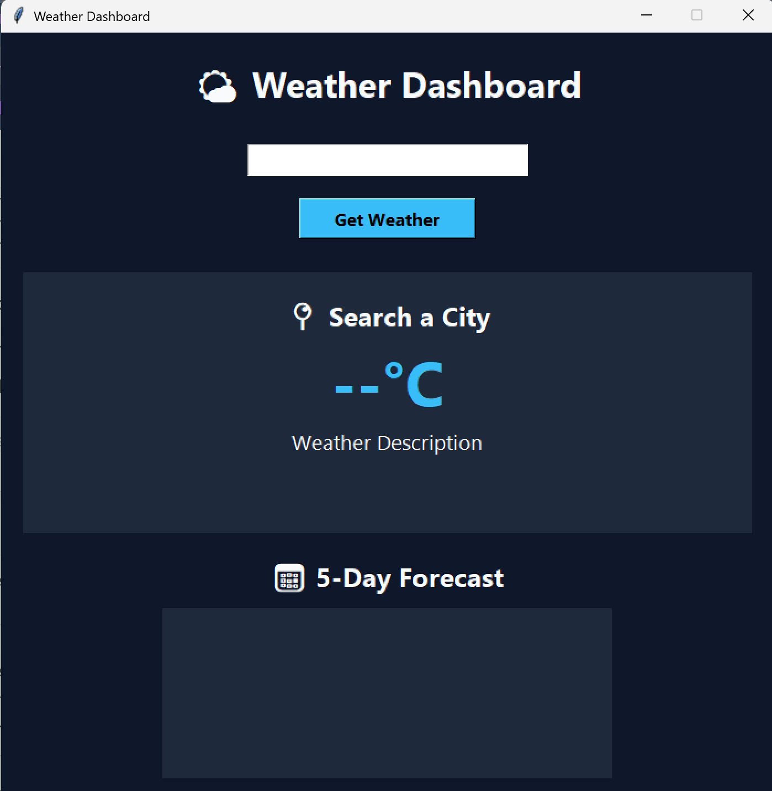
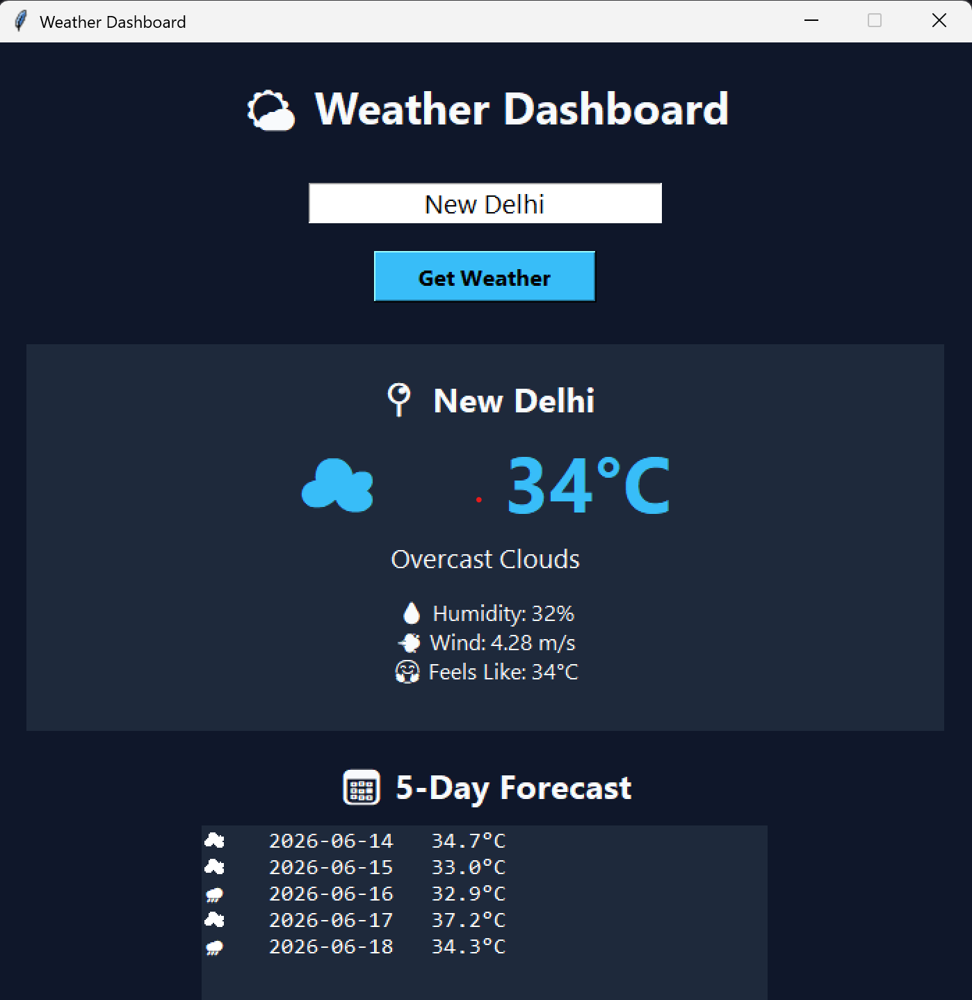

# 🌤️ Weather Dashboard

<div align="center">


### A modern weather dashboard built with Python, Tkinter, and OpenWeatherMap API

</div>

---

## 🌟 Features

✅ Real-time weather information

✅ 5-Day weather forecast

✅ Temperature, humidity, wind speed & feels-like temperature

✅ Smart weather tips

✅ Modern dark-themed interface

✅ Keyboard-friendly search (Press Enter)

✅ Error handling and API integration

---

## 🖼️ Application Preview

| Home Screen | Weather Output |
|------------|---------------|
|  |  |

---

## 🛠️ Built With

- 🐍 Python
- 🖥️ Tkinter
- 🌐 Requests
- 🔐 Python Dotenv
- ☁️ OpenWeatherMap API

---

## 📂 Project Structure

```text
Weather-App/
│
├── hello.py
├── requirements.txt
├── README.md
├── .gitignore
├── .env.example
│
├── screenshots/
│   ├── home-screen.png
│   └── weather-output.png
│
└── LICENSE
```

---

## 🚀 Installation

### 1️⃣ Clone the Repository

```bash
git clone https://github.com/YOUR_USERNAME/weather-dashboard.git
```

### 2️⃣ Navigate to the Project Directory

```bash
cd weather-dashboard
```

### 3️⃣ Install Dependencies

```bash
pip install -r requirements.txt
```

### 4️⃣ Create a .env File

Create a file named:

```text
.env
```

Add your OpenWeatherMap API key:

```env
OPENWEATHER_API_KEY=your_api_key_here
```

---

## 🔑 Getting an API Key

1. Create a free account at OpenWeatherMap
2. Navigate to API Keys
3. Generate a new API key
4. Add it to your `.env` file

---

## ▶️ Run the Application

```bash
python hello.py
```

---

## 🌦️ Example Output

```text
📍 Delhi

☀️ 35°C

Weather: Clear Sky

💧 Humidity: 30%
💨 Wind Speed: 4.4 m/s
🤗 Feels Like: 34°C

📅 5-Day Forecast
```

---

## 🎯 Future Improvements

- 🌙 Enhanced Dark Mode
- 📈 Weather Trend Charts
- 🗺️ Auto Location Detection
- 🔔 Weather Alerts
- 🖼️ Dynamic Weather Backgrounds
- 📱 Mobile Version

---

## 🤝 Contributing

Contributions are welcome.

Feel free to fork this repository and submit a pull request.

---

## 📜 License

This project is licensed under the MIT License.

---

## 👨‍💻 Author

### Piyush Negi

**Software QA Engineer at Keywords Studios**  
**Python Enthusiast | Game Tester**

Passionate about software quality assurance, test automation, game testing, and building practical applications with Python.

### 🔗 Connect with Piyush

[](https://www.linkedin.com/in/piyush-negi-9b2758216/)

---

<div align="center">

### ⭐ If you found this project useful, consider giving it a star!

Made with ❤️ using Python

</div>